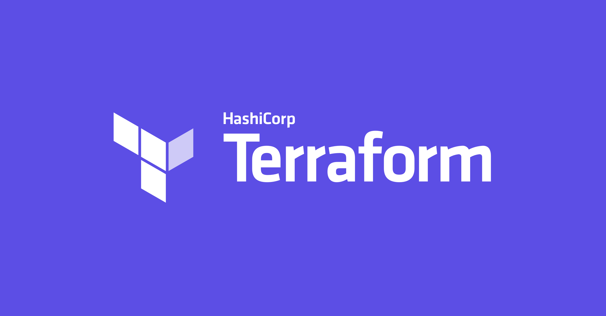
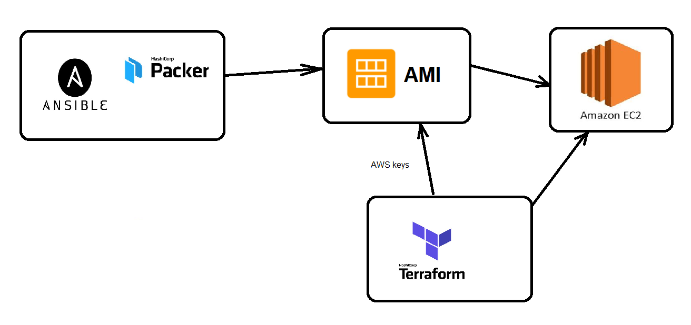

# IAC-Terraform

- Terraform is an IAC orchestration tool - it allows you to create IAC for deployment on any cloud
- Terraform means "transform the earth"
- It is Hashicorp product

## Why Terraform
- Helps you scale up and scale down as per the user demand.


### Best use cases
- it makes cloud independant - works with AWS-Azure-GCP and others
- 
**Other IAC tools**
- Orchestration with terraform
- from an AMI to EC2 with customised configuration

## Downloading in linux
Follow the following commands
```bash
curl -fsSL https://apt.releases.hashicorp.com/gpg | sudo apt-key add -
sudo apt-add-repository "deb [arch=$(dpkg --print-architecture)] https://apt.releases.hashicorp.com $(lsb_release -cs) main"
sudo apt install terraform
```

## commands
- validate your .tf files
```bash
terraform validate
```
- plan your infrastructure
```bash
terraform plan
```
- build your infrastructure
```bash
terraform apply
```
- find more commands
```bash
terraform
```


## Terraform modules
We can abstract complexity using modules.
We have placed all the code relevant to the app tier in a module called app tier.
Then we called the module in the main file:
```bash
modules "app" {
    source = "./modules/app_tier"
}
```

Then we had to make variable in the /modules/app_tier/variables.tf and pass these when calling the app module:

```bash
module "app" {
    source = "./modules/app_tier"
    vpc-terraform-name-id = aws_vpc.vpc-terraform-name.id
    eng_class_person = var.eng_class_person
}
```

we also had to adapt the calling fo these variables in the ./modules/app_tier/main.tf


#### Using outputs in modules

When we want to get information from a piece of infrastructure that will be abstracted in the modules, we can use output file to get this output.